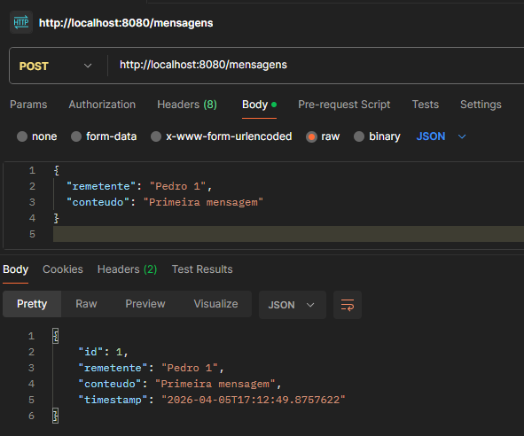
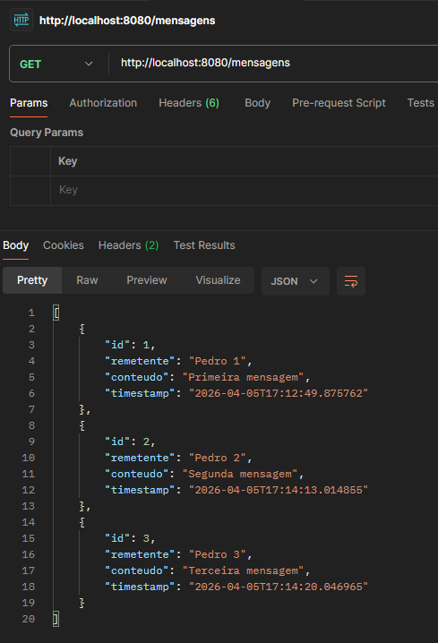
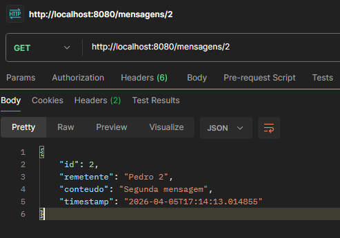
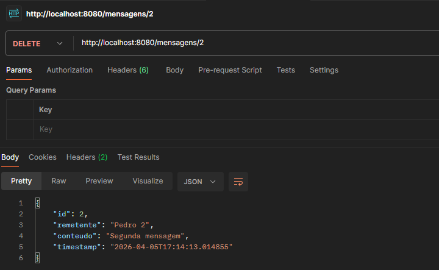
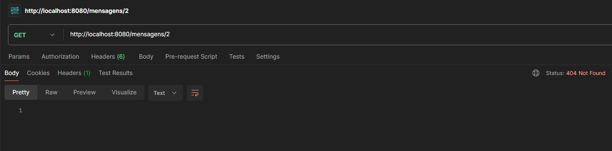

# Mensagens em Quarkus

API REST simples para cadastro e consulta de mensagens.

## Rodar local

```powershell
.\mvnw.cmd quarkus:dev
```

API: `http://localhost:8080`

## Endpoints

- `POST /mensagens` - cria mensagem
- `GET /mensagens` - lista mensagens
- `GET /mensagens/{id}` - busca por id
- `DELETE /mensagens/{id}` - remove por id

Exemplo de body para `POST /mensagens`:

```json
{
  "remetente": "Pedro",
  "conteudo": "Mensagem de teste"
}
```

## Evidencias de testes (substituir depois)

### Cadastro - `POST /mensagens`
Resultado esperado: mensagem criada com sucesso (status `201`).



### Listagem - `GET /mensagens`
Resultado esperado: retorno da lista de mensagens (status `200`).



### Busca por id - `GET /mensagens/{id}`
Resultado esperado: retorno da mensagem correspondente ao id (status `200`).


### Delecao - `DELETE /mensagens/{id}`
Resultado esperado: mensagem removida com sucesso (status `200`).




